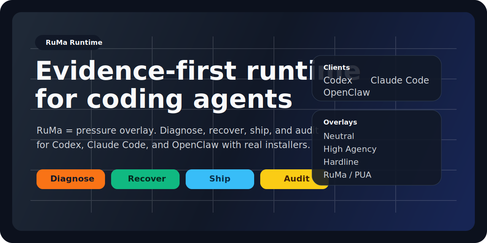

<p align="center">
  
</p>

<p align="center">
  <strong>RuMa = a pressure overlay for coding agents.</strong><br />
  Package <code>diagnose / recover / ship / audit</code> into a real runtime for <code>Codex</code>, <code>Claude Code</code>, and <code>OpenClaw</code>.
</p>

<p align="center">
  <a href="./README.md">简体中文</a> · <strong>English</strong>
</p>

## What It Is

RuMa Runtime is not just a prompt dump.

It combines:

- operating modes: `diagnose`, `recover`, `ship`, `audit`
- overlays: `neutral`, `high-agency`, `hardline`, and `RuMa / PUA`
- direct installers for `Codex`, `Claude Code`, and `OpenClaw`
- a browsable web surface
- Playwright smoke coverage and a local autopilot loop

## What It Fixes

| Failure pattern | Old behavior | Runtime behavior |
| --- | --- | --- |
| Repeating the same route | tweak the same patch over and over | switch to a materially different approach on the second failure |
| Blaming the environment | speculate about permissions or API support | produce logs, docs, versions, or command output first |
| Claiming done without proof | report completion without validation | run build, test, curl, or the real path first |
| Passive waiting | ask the user before investigating | search, inspect, and execute before asking |

## Install

### Local one-command install

```bash
npm install
npm run install:all
```

Or per client:

```bash
npm run install:codex
npm run install:claude
npm run install:openclaw
```

### Manual install

#### Codex

```bash
mkdir -p ~/.codex/skills/ruma-runtime ~/.codex/prompts
curl -L https://raw.githubusercontent.com/Rrocean/ruma-runtime/main/adapters/codex/ruma-runtime/SKILL.md -o ~/.codex/skills/ruma-runtime/SKILL.md
curl -L https://raw.githubusercontent.com/Rrocean/ruma-runtime/main/commands/ruma-runtime.md -o ~/.codex/prompts/ruma-runtime.md
```

#### Claude Code

```bash
mkdir -p ~/.claude/skills/ruma-runtime
curl -L https://raw.githubusercontent.com/Rrocean/ruma-runtime/main/adapters/claude/ruma-runtime/SKILL.md -o ~/.claude/skills/ruma-runtime/SKILL.md
```

#### OpenClaw

```bash
mkdir -p ~/.openclaw/skills/ruma-runtime
curl -L https://raw.githubusercontent.com/Rrocean/ruma-runtime/main/adapters/openclaw/ruma-runtime/SKILL.md -o ~/.openclaw/skills/ruma-runtime/SKILL.md
```

## References

- [runtime-playbook.md](./references/runtime-playbook.md)
- [failure-patterns.md](./references/failure-patterns.md)

## Verify

```bash
npm run build
npm run test
npm run check
```

## Autopilot

```bash
npm run autopilot:register
npm run autopilot:once
npm run qa:loop
```

## License

[MIT](./LICENSE)
